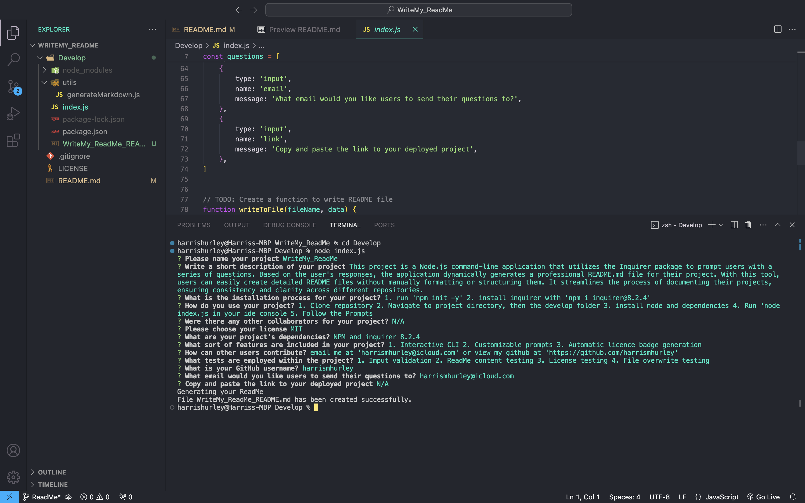
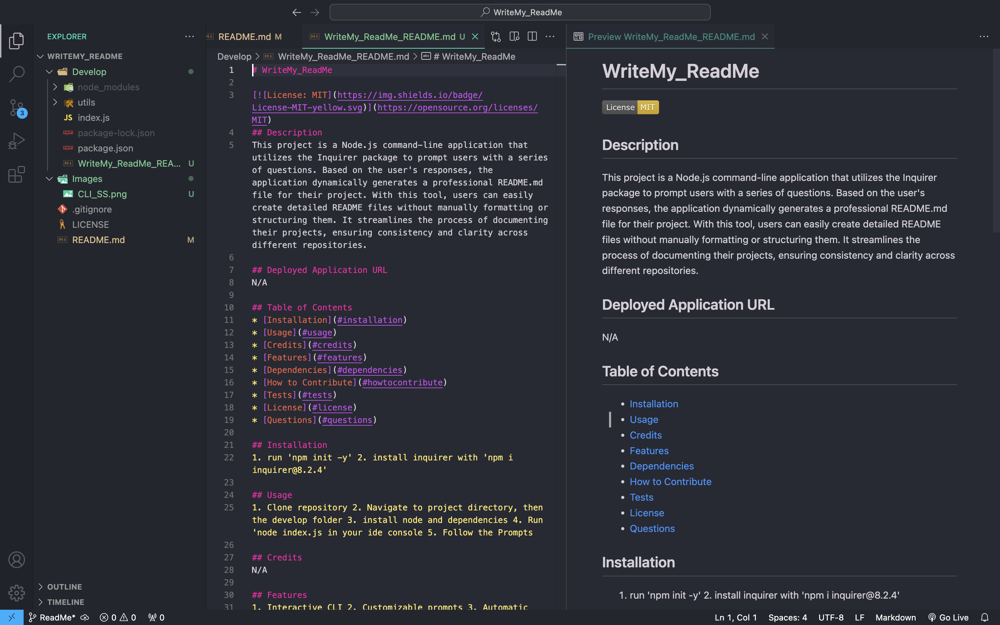

# WriteMy_ReadMe
    

## Description
This project is a Node.js command-line application that utilizes the Inquirer package to prompt users with a series of questions. Based on the user's responses, the application dynamically generates a professional README.md file for their project. With this tool, users can easily create detailed README files without manually formatting or structuring them. It streamlines the process of documenting their projects, ensuring consistency and clarity across different repositories.

## Deployed Application URL
N/A

## Table of Contents
* [Installation](#installation)
* [Usage](#usage)
* [Credits](#credits)
* [Features](#features)
* [Dependencies](#dependencies)
* [Screenshots](#screenshots)
* [Walkthrough](#walkthrough)
* [How to Contribute](#how-to-contribute)
* [Tests](#tests)
* [License](#license)
* [Screenshots](#screenshots)

## Installation
1. run 'npm init -y'
2. install inquirer from node 'npm i inquirer@8.2.4'

## Usage
To use this application, follow these steps:

1. Clone the repository to your local machine using the following command:
'git clone git@github.com:harrismhurley/WriteMy_ReadMe.git'
2. Navigate to the project directory, then to the 'Develop' folder.
3. Install the required dependencies using npm:
'npm init -y'
4. Run the application by executing the following command:
'node index.js'
5. Follow the prompts in the command line interface to provide the necessary information for generating your README file.
6. Once you have completed all the prompts, the application will automatically generate a README.md file in the project directory.
7. You can find the generated README.md file in the project directory and customize it further if needed.

## Credits
[Grace Choi](https://github.com/gachoi06)
[Xander Rapstine](https://github.com/Xandromus)

## Features
- Interactive command-line interface powered by Inquirer.
- Customizable prompts for various sections of the README, such as title, description, installation, usage, credits, features, dependencies, contribution, testing instructions, and license selection.
- Automatic generation of a license badge and license section based on the chosen license.
- Seamless integration with GitHub repositories, providing links to the user's GitHub profile and enabling direct communication via email.

## Dependencies
"inquirer": "8.2.4"

## Screenshots

## Walkthrough
[Walkthrough Video](Images/Walkthrough.webm)

## How to Contribute
If you would like to contribute you can contact me [Via Email](mailto:harrismhurley@icloud.com?subject=[GitHub]%20Dev%20Connect) or visit [github](https://github.com/harrismhurley).

## Tests
1. Input Validation Testing:
	- Test the application with invalid inputs (empty strings, special characters, etc.) and ensure it handles them gracefully.
	- Test with valid inputs to ensure the application accepts them correctly.
2. README Content Testing:
	- Verify that all the sections in the generated README are present (Description, Installation, Usage, etc.).
	- Check that the content provided by the user is correctly displayed in the corresponding sections of the README.
	- Ensure that the URL provided by the user for the Deployed Application is correctly formatted and displayed.
3. License Testing:
	- Test the application with different license options and verify that the appropriate license badge and section are included in the README.
	- Ensure that the license link provided in the README is correct and leads to the corresponding license page.
4. File Overwrite Testing:
	- Ensure that the application does not overwrite an existing README file without user confirmation.
	- Test the application's behavior when the user chooses to overwrite an existing README file.

## License 
This project is licensed under the [MIT](https://opensource.org/licenses/MIT) license.

